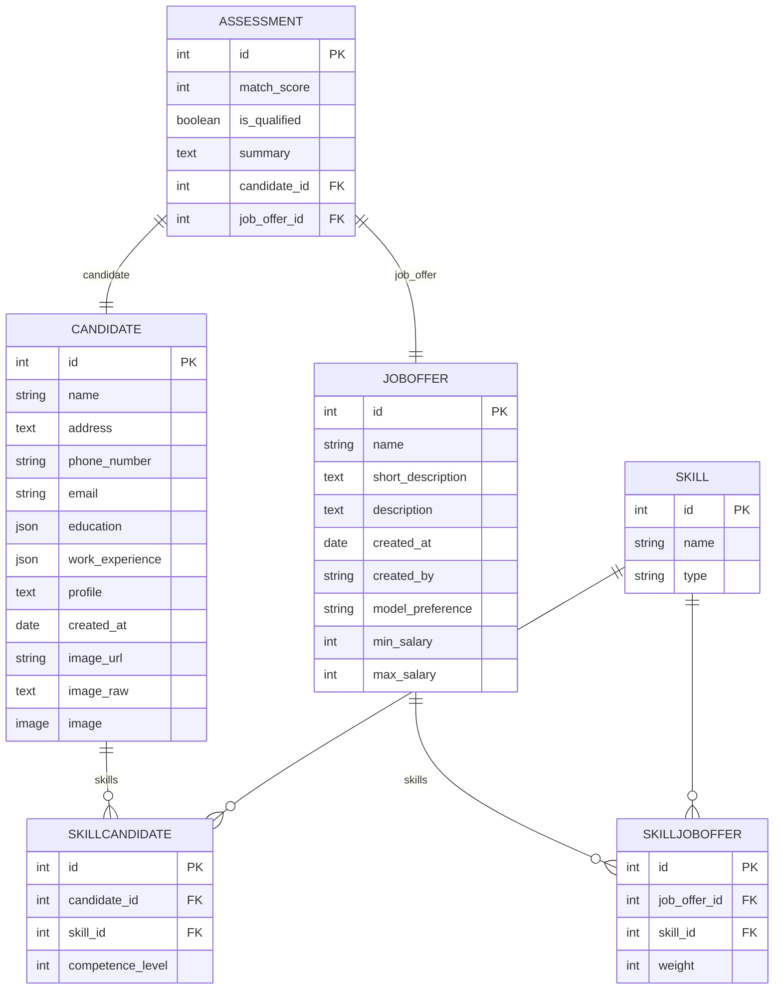

# Remix testing repo

## TODO

- [x] setup tailwind
- [x] setup shadcn/ui
- [x] setup darkmode
- [x] propse basic layout
- [x] use proper breadcrumbs
- [x] get theming working

### Research

- [ ] Streaming data (response from AI)

## Segments worked on

Segment | Sub-segment | Progress |
--------|-------------|--------- |
Candidates | List | / (implmented list) |
Candidates | Upload | - |
Candidates | Individual | - |
JobOffers | List | X (implemented list) |
JobOffers | New | X (implemented dialog form [doesn't work]) |
JobOffers | Individual | X |
JobOffers | Assessment | - |
JobOffers | Top Candidates | - |
JobOffers | Qualified/Unqualified | - |
JobOffers | Questionnaire | - |
Questions | New | - |
Questions | List | - |
Platform | New | - |
Platform | Launch | - |
*Prompts* | List | - |
*Prompts* | New | - |

## Data diagram

